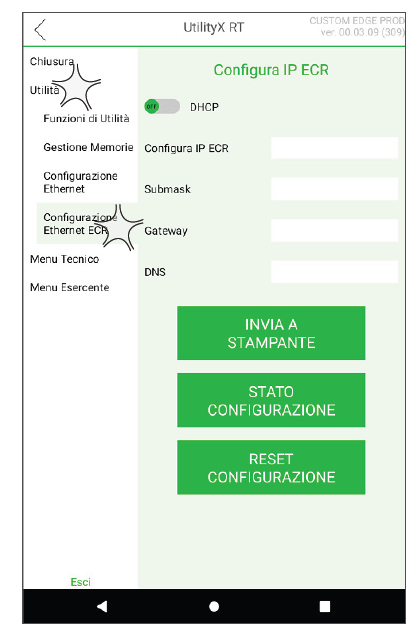
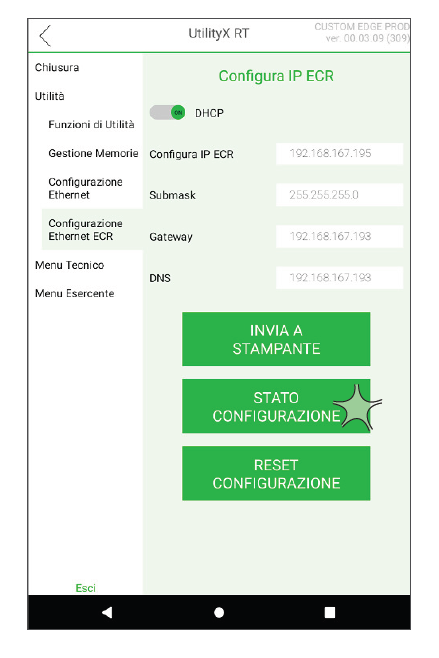
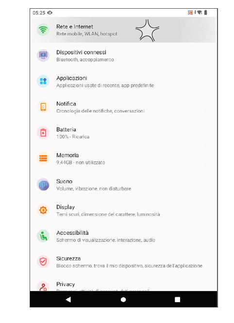
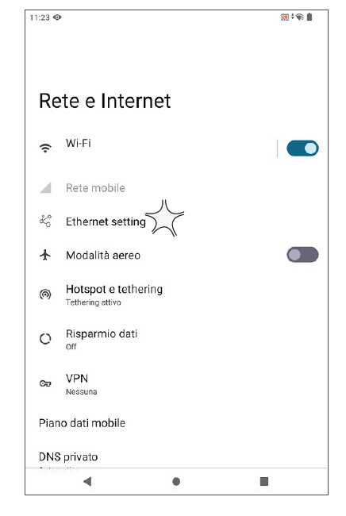
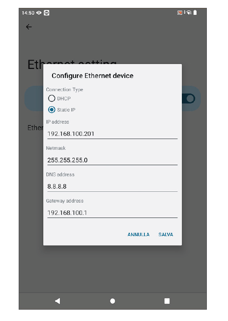
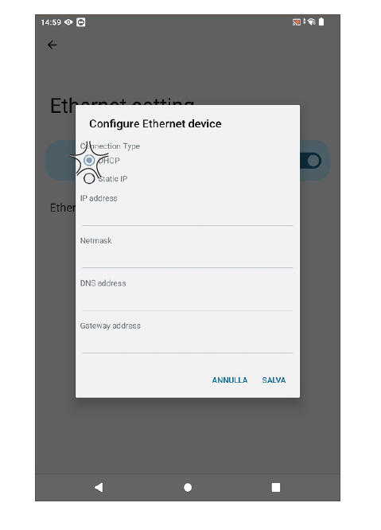
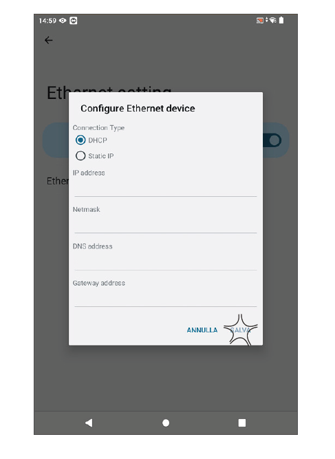

# Procedure di configurazione Ethernet

## Video Tutorial CONNESSIONE ETHERNET

<video controls width="100%">
  <source src="/corso-tecnico-edge-n/assets/resources/ethernet.mp4" type="video/mp4">
  Il tuo browser non supporta il tag video.
</video>

## Configurazione rete Modulo Fiscale

* Avviare UtilityX RT
* All'interno del menù **UTILITA'** premere la voce **CONFIGURAZIONE ETHERNET ECR**

* Attivare la voce **DHCP** 

* Premere **INVIA A STAMPANTE**

* Sul display lato cliente, dopo alcuni istanti, comparirà l'indirizzo IP del dispositivo che è stato attribuito dalla rete. Questo indirizzo IP sarà quello che dovrà essere digitato nel browser per poter raggiungere la tastiera virtuale. Per visualizzare l'indirizzo IP acquisito dal dispositivo, premere il pulsante **STATO CONFIGURAZIONE**

* Premere **ESCI** per uscire dall'applicazione UtilityX RT, in quanto configurazione lato Modulo Fiscale, conclusa.

## Impostazione rete Android

* Premere l'icona **IMPOSTAZIONI**
* Selezionare la voce **RETE E INTERNET**

* Selezionare la voce **ETHERNET SETTING**

* Selezionare la voce **ETHERNET CONFIGURATION**; viene visualizzata la seguente schermata.

* Attivare la voce **DHCP**

* Premere **SALVA** per confermare

* Riavviare il dispositivo tenendo premuto il pulsante di accensione per almeno 3 secondi e selezionare **RIAVVIA**, per rendere effettive le modifiche.
(assets/images/riavvia.png)
