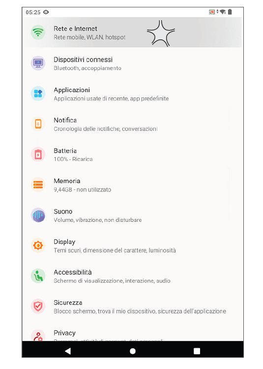
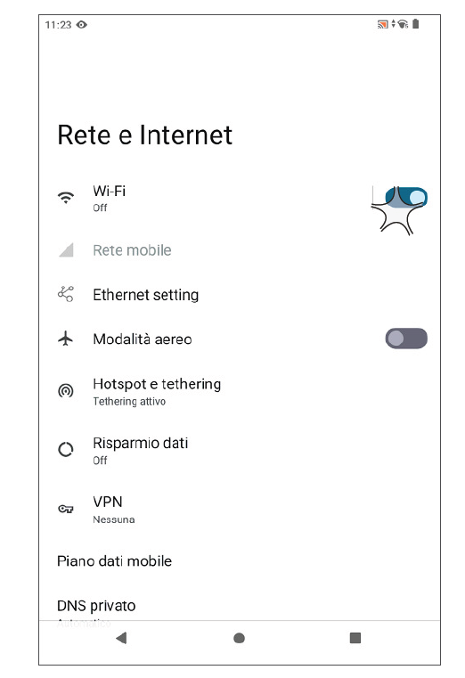
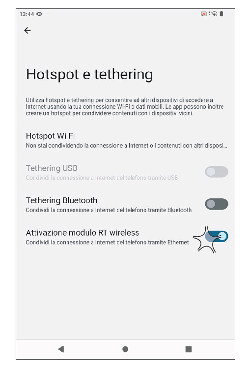
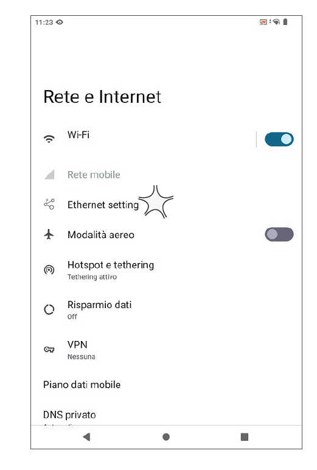

# Come connettere EDGE N/N+ tramite WIFI

## Video Tutorial CONNESSIONE WIFI

<video controls width="100%">
  <source src="/corso-tecnico-edge-n/assets/resources/wifi.mp4" type="video/mp4">
  Il tuo browser non supporta il tag video.
</video>

## Configurazione WIFI Modulo Android

* Selezionare la voce RETE E INTERNET da IMPOSTAZIONI di Android

* Selezionare la voce WIFI

* Selezionare SSID rete desiderato ed inserire _passoword_ di rete

* Una volta connessa alla rete WIFI ed acquisito Indirizzo Ip e connessione internet ok è fondamentale _**ATTIVARE HOTSPOT E TETHERING** in modo tale che la connessione internet ora acquisita da Android sia disponibile anche per la connessione del Modulo Fiscale_

<*ATTENZIONE BENE**
**Quando si disattiva la condivisione tramite HOTSPOT TETHERING con "ATTIVAZIONE MODULO RT WIRELESS" precedentemente attivata, è necessario ATTIVARE MANUALMENTE la funzionalità Ethernet tramite IMPOSTAZIONI - RETE E INTERNET - ETHERNET SETTING in quanto risulterà automaticamente DISATTIVATA e non è prevista l'ATTIVAZIONE AUTOMATICA.**>

## Configurazione WIFI Modulo Fiscale

* Avviare UtilityX RT
* All'interno del menù **UTILITA'** premere la voce **CONFIGURAZIONE ETHERNET ECR**

* Attivare la voce **DHCP**, di default già attiva

* Premere **INVIA A STAMPANTE**

* Sul display lato cliente, dopo alcuni istanti, comparirà l'indirizzo IP del dispositivo che è stato attribuito dalla rete. Questo indirizzo IP sarà quello che dovrà essere digitato nel browser per poter raggiungere la tastiera virtuale. Per visualizzare l'indirizzo IP acquisito dal dispositivo, premere il pulsante **STATO CONFIGURAZIONE**

* Premere **ESCI** per uscire dall'applicazione UtilityX RT, in quanto configurazione lato Modulo Fiscale, conclusa.

### Scarica la guida alle connessioni di rete 
[Guida di configurazione Edge N / N+](assets/resources/guidaconnessioniedge.PDF)