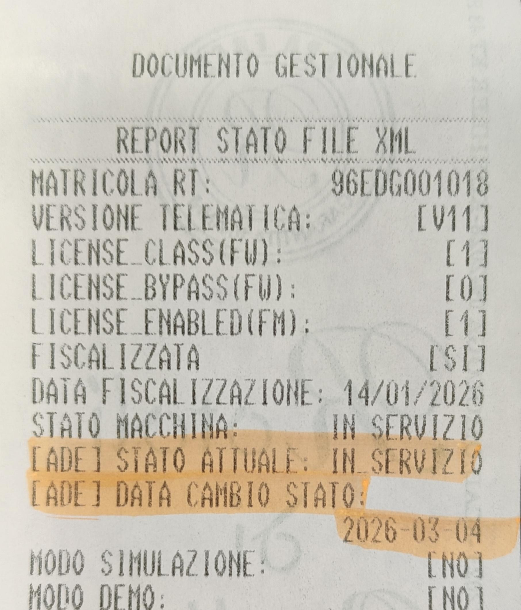

# RISOLUZIONE DISALLINEAMENTO 409 http 200 XML

Il problema descritto (errore dovuto a disallineamento in cui il portale AdE indica "Disattivato" e la cassa "In servizio") è una situazione specificamente gestita dalle nuove normative introdotte con le Specifiche Tecniche RT V11.1.

Quando lo stato del Registratore Telematico viene modificato direttamente sul portale Fatture e Corrispettivi (Cassetto Fiscale) in "Disattivato", il dispositivo fisico locale non si aggiorna automaticamente. Al primo tentativo di trasmissione o interrogazione, il dispositivo rileva il disallineamento e interviene un blocco di sicurezza.

In questa situazione, il dispositivo non emette più documenti commerciali e stampa un documento gestionale con il messaggio di avviso: "ATTENZIONE! DISPOSITIVO BLOCCATO NECESSARIO INTERVENTO TECNICO PER LO SBLOCCO".

_ANOMALIA: IL DISPOSITIVO RISULTA DISATTIVATO SUL SERVER_

Come risolvere il disallineamento (Errore 409)

Per sbloccare l'EDGE-N e riallineare gli stati, è obbligatorio l'intervento di un Tecnico Abilitato. L'esercente non può risolvere questa situazione in autonomia.

Il tecnico dovrà seguire questi passaggi:

Comprendere lo stato "Disattivato" Poiché sul server dell'Agenzia delle Entrate la macchina risulta "Disattivata", significa che è stata cancellata l'associazione tra la matricola del Registratore Telematico e la Partita IVA dell'esercente (e il certificato è sospeso).

Eseguire una nuova Attivazione Per ripristinare il funzionamento e riallineare la cassa, il tecnico deve eseguire una nuova procedura di ATTIVAZIONE direttamente dal dispositivo. Questa operazione può essere fatta tramite l'app UtilityX RT (oppure da Web Server) procedendo come segue:

Accedere al Menù Tecnico di UtilityX RT (inserendo la password).

Andare nel pannello ATTIVAZIONE.

Reinserire il Codice Fiscale del tecnico, la P.IVA del laboratorio e la P.IVA/Codice Fiscale dell'esercente ATTENZIONE: DEVE ESSERE LA PARTITA IVA DELL’ESERCENTE SUL QUALE E' STATA EFFETTUATA LA DISATTIVAZIONE DAL CASSETTO FISCALE, insieme ai dati del punto vendita.

Premere ESEGUI ATTIVAZIONE.  Abilitare flag TELEMATICO e flag ATTIVA ADESSO.

Questo comunicherà al server AdE che l’RT è in stato ATTIVATO 

---

In questo modo sia il cassetto e l’RT sono nella stessa condizione di essere **IN SERVIZIO**, questo consente ora di effettuare, se voluto DISATTIVAZIONE, di seguito P699 di STATO rt disattivato. 

_ATTENZIONE CHE COMUNQUE LA P699 PRESENTA LO STATO DI:_

 [ADE] STATO ATTUALE: IN_SERVIZIO (anche se lo stato macchina è correttamente DISATTIVATO) 

---

Anche se il messaggio può apparire ingannevole e sintomo di disallineamento tra ade ed rt, questa condizione non inficia nella nuova **MESSA IN SERVIZIO** su partita iva esercente desiderata. 

Di seguito si riporta la P699

