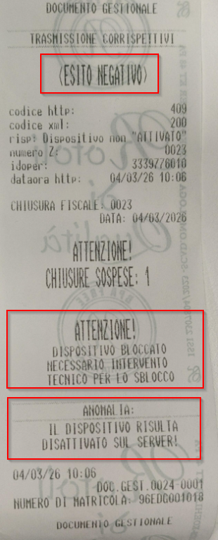
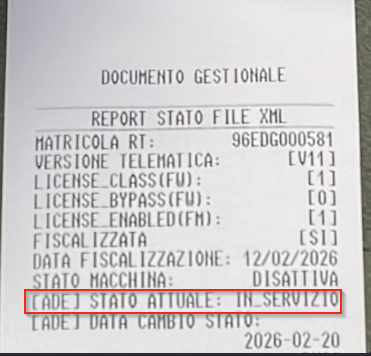

# RISOLUZIONE DISALLINEAMENTO HTTP 409

Il problema descritto (errore dovuto a disallineamento in cui il portale AdE indica "Disattivato" e la cassa "In servizio") è una situazione specificamente gestita dalle nuove normative introdotte con le Specifiche Tecniche RT V11.1.

Quando lo stato del Registratore Telematico viene modificato direttamente sul portale Fatture e Corrispettivi (Cassetto Fiscale) in "Disattivato", il dispositivo fisico locale non si aggiorna automaticamente. Al primo tentativo di trasmissione o interrogazione, il dispositivo rileva il disallineamento e interviene un blocco di sicurezza.

In questa situazione, il dispositivo non emette più documenti commerciali e stampa un documento gestionale con il messaggio di avviso: "ATTENZIONE! DISPOSITIVO BLOCCATO NECESSARIO INTERVENTO TECNICO PER LO SBLOCCO".

_ANOMALIA: IL DISPOSITIVO RISULTA DISATTIVATO SUL SERVER_

## Come risolvere il disallineamento (Errore HTTP 409)

Per sbloccare l'EDGE-N e riallineare gli stati, è obbligatorio l'intervento di un Tecnico Abilitato.
**L'esercente non può risolvere questa situazione in autonomia.**

Il tecnico dovrà seguire questi passaggi:

### Comprendere lo stato "Disattivato" 

Poiché sul server dell'Agenzia delle Entrate l' RT risulta "Disattivata", significa che è stata cancellata l'associazione tra la matricola del Registratore Telematico e la Partita IVA dell'esercente tramite accesso diretto al _Cassetto Fiscale_ dell'esercente, nel Portale di Agenzia delle Entrate.
Per avere la certezza di questo stato si consiglia di accedere a:

* UtilityX RT
* UTILITA'
* STATO STAMPANTE (Richiesta stato RT)

Esegue automaticamente la STAMPA DELLA P-699 **SERVIZI TELEMATICI**
verificare come da immagine lo
**stato macchina**
[ade] **stato attuale**

di seguito esempio di P-699 in _STATO DISALLINEATO_

## Eseguire una nuova Attivazione

Per ripristinare il funzionamento e riallineare la cassa, il tecnico deve eseguire una nuova procedura di **ATTIVAZIONE** direttamente dal dispositivo.
Questa operazione può essere eseguita tramite l'app UtilityX RT procedendo come da video tutorial:

## Video Tutorial FUORI SERVIZIO

<video controls width="100%">
  <source src="/corso-tecnico-edge-n/assets/resources/409.mp4" type="video/mp4">
  Il tuo browser non supporta il tag video.
</video>

* Accedere al Menù Tecnico di UtilityX RT
* Inserire Password: 147896
* Pannello ATTIVAZIONE

Reinserire il Codice Fiscale del tecnico, la P.IVA del laboratorio e la P.IVA/Codice Fiscale dell'esercente ATTENZIONE: 
**DEVE ESSERE LA PARTITA IVA DELL’ESERCENTE SUL QUALE E' STATA EFFETTUATA LA DISATTIVAZIONE DAL CASSETTO FISCALE**, insieme ai dati del punto vendita.

* Abilitare flag TELEMATICO e flag ATTIVA ADESSO
Premere **ESEGUI ATTIVAZIONE**

Questo comunicherà al server AdE che l’RT è in stato **ATTIVATO**

---

In questo modo sia il cassetto e l’RT sono nella stessa condizione di essere **IN SERVIZIO** 

### DISATTIVAZIONE O ALTRE OPERAZIONI TELEMATICHE

Una volta eseguita la nuova procedura di attivazione per riallineare l'RT al server di AdE, è possibile effettuare
**TUTTE LE OPERAZIONI TELEMATICHE** previste dalla normativa:

* DISATTIVAZIONE
* DISMISSIONE
* FUORI SERVIZIO 

