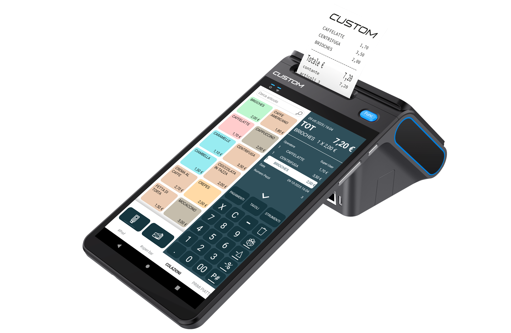
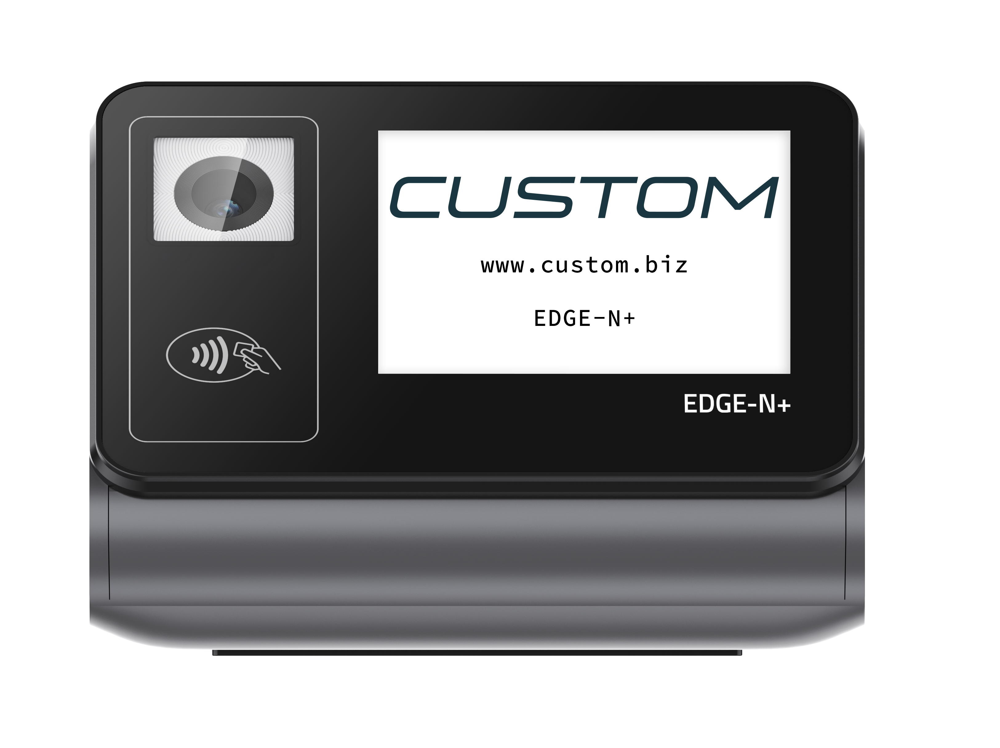
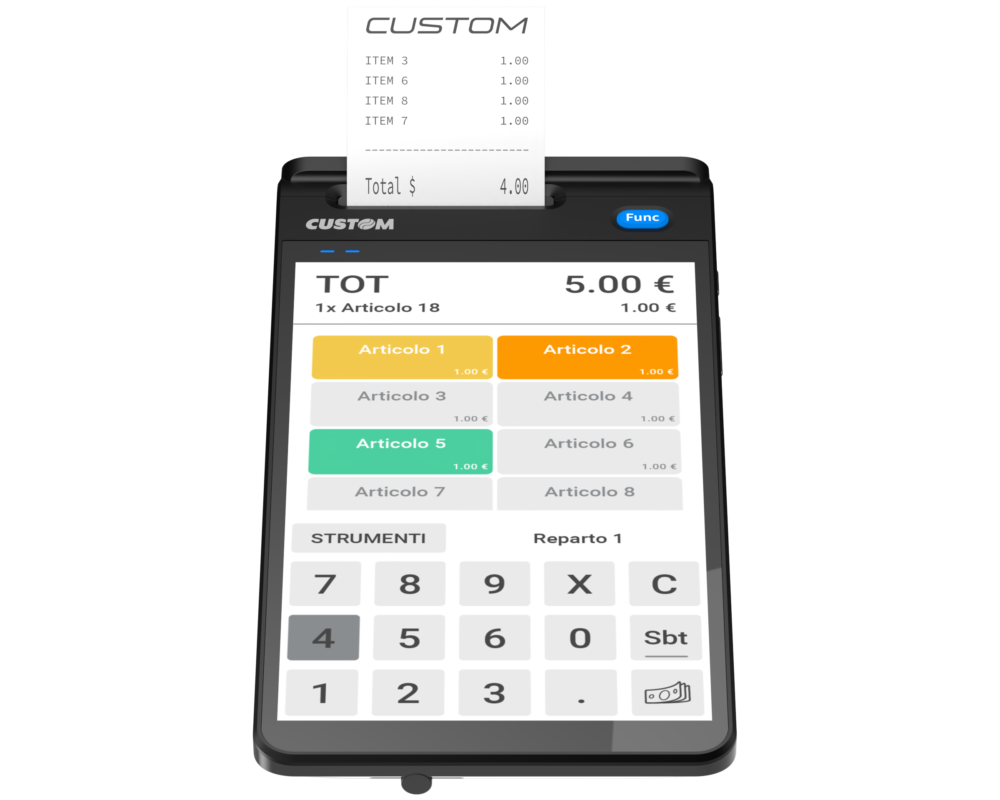

# **EDGE N ed N+**

Questo portale documentale ha l'obiettivo di fornire le competenze tecniche necessarie per l'installazione, la configurazione e la manutenzione dei dispositivi telematici di **Custom S.p.A.** della serie **EDGE**.

Siamo convinti che con questo metodo di condivisione delle conoscenze, tramite sito dedicato, saremo in grado di soddisfare le necessità operative dei nostri **_Partners_**, essendo in grado di mantenere costantemente aggiornata la documentazione ed offrendo un canale di comunicazione rapido, efficace e di facile consultazione.

---

In questo spazio analizziamo l'intera architettura hardware e software: partendo dalle caratteristiche hardware dei dispositivi, passando per le specifiche normative RT XML 7 Versione 11.1 dell'Agenzia delle Entrate, continuando con le configurazioni di rete per il corretto adempimento degli obblighi telematici, fino alle *best practice* di intervento e al troubleshooting.

La formazione si concentrerà inoltre sull'utilizzo dei registratori telematici Edge N / N+ in abbinamento con il software di frontend **KEEPUP SMART**, con particolare attenzione alla configurazione di **Edge N+** per pagamenti digitali tramite applicativo **SOFTPOS** in convenzione con **CUSTOM PAY**.

---

| **CUSTOM EDGE N+**   *(Architettura Performance)* | **CUSTOM EDGE N**   *(Architettura Standard)* |
| :--- | :--- |
|  |  |
| **Core:** Android™ 13 (Hexa-Core) | **Core:** Android™ 12 (Quad-Core) |
| **Connettività:** Wi-Fi, 4G, BT, Eth | **Connettività:** Wi-Fi, 4G, BT, Eth |
| **Innovazione:** Predisposto SoftPOS (NFC Avanzato) | **Mobilità:** Ottimizzato per uso ambulante |
| **Target:** App intensive e terze parti | **Target:** Standard Retail e KeepUp |
| **RT:** Nativo V11.1 (Crypto-chip) | **RT:** Nativo V11.1 (Crypto-chip) |

---

### Mercati di riferimento

* **Minimarket:** Form factor compatto *All-in-One* ideale per banchi cassa con spazio limitato e necessità di collegamento diretto a scanner barcode USB.
* **Retail Tradizionale:** Architettura LAN cablata (Ethernet RJ45) che garantisce la massima stabilità nella trasmissione telematica XML dei corrispettivi.
* **Forni e Pasticcerie:** Interfaccia Touchscreen capacitiva industriale adatta a ritmi di digitazione elevati e facile sanificazione del pannello frontale.
* **Negozi di prossimità:** Soluzione che integra RT e logica applicativa eliminando la necessità di PC dedicati e riducendo i punti di guasto hardware (SPOF).
* **Ambulanti Evoluti:** Operatività in mobilità garantita da batteria Li-Ion sostituibile, connettività 4G/LTE nativa e display ad alta luminosità per uso esterno.

