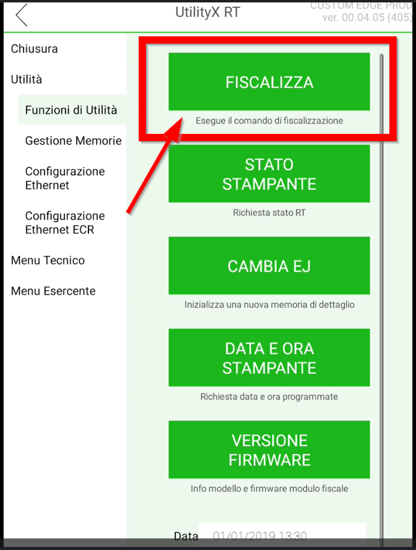
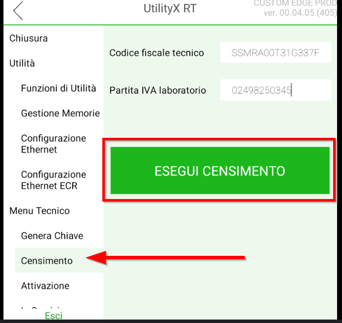
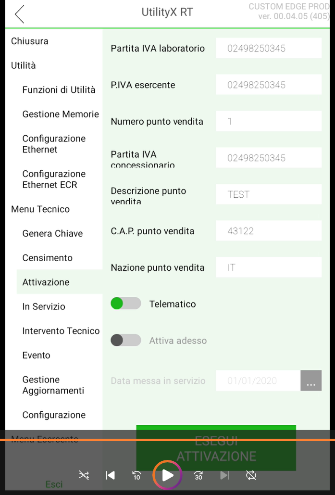

# Messa in servizio RT Serie Edge
I Registratori Telematici (RT) della serie Edge, in stretta conformità con le specifiche tecniche dettate dall'Agenzia delle Entrate, richiedono una rigorosa procedura di messa in servizio prima del loro effettivo utilizzo presso l'esercente finale.

## Video Tutorial **MESSA IN SERVIZIO RT**

<video controls width="100%">
  <source src="/corso-tecnico-edge-n/assets/resources/messainservizio.mp4" type="video/mp4">
  Il tuo browser non supporta il tag video.
</video>

---

#### DOCUMENTAZIONE UTILE
[Manuale di assistenza EDGE N/N+](assets/resources/manualeassistenzaedgen_edgen2.PDF)

---

## Procedure e Strumenti Operativi

Per ottimizzare i flussi di lavoro sul campo e velocizzare le operazioni di attivazione, l'iter operativo consigliato prevede l'utilizzo del software **UtilityX Rt.**
Questo strumento diagnostico e di configurazione è sviluppato per interfacciarsi direttamente con i protocolli nativi del dispositivo.
L'applicativo consente al personale tecnico di compilare e trasmettere l'intero set di parametri fiscali aggirando completamente la navigazione tramite web browser e l'uso della tastiera virtuale.

L'adozione di questo tool assicura il completamento rapido e preciso della procedure di:

## Fiscalizzazione
Prima di cominciare la procedura di censimento dell'RT presso in server AdE, è necessario eseguire il semplice comando di **Fiscalizza** RT tramite UtilityX RT.
### Fiscalizzazione da UtilityX RT
* **MENU' TECNICO**
* **UTILITA** - **Funzioni di Utilità**
* **FISCALIZZA**

## Censimento
A livello normativo, il "censimento" del Registratore Telematico (RT) rappresenta la prima operazione ufficiale di registrazione e riconoscimento dell'hardware presso i sistemi informatici dell'Agenzia delle Entrate.
In sintesi, il censimento comporta i seguenti passaggi e implicazioni:
* _Richiesta del Certificato_: Il dispositivo si collega al sistema dell'Agenzia delle Entrate e, utilizzando il certificato di firma del fabbricante, invia i propri dati identificativi (matricola, marca, modello, chiave pubblica) insieme al codice fiscale del tecnico abilitato e alla Partita IVA del laboratorio che sta eseguendo l'operazione.
* _Rilascio del Certificato Dispositivo_: Se i dati sono corretti e la matricola è congruente con i database, l'Agenzia delle Entrate iscrive l'apparecchio nella propria anagrafica e rilascia il "Certificato Dispositivo" **(che ha una validità di 8 anni)**.
Questo certificato viene salvato nella memoria inalterabile del registratore e servirà per firmare digitalmente tutte le future trasmissioni dei corrispettivi.
* _Stato "Censito"_: Una volta completata questa procedura, il RT acquisisce lo stato normativo di "Censito"
. È importante notare che, in questo stato, la macchina è nota al Fisco ma non è ancora associata a nessun esercente. Di conseguenza, un RT che si trova nello stato "solo censito" può emettere esclusivamente Documenti Gestionali (non fiscali) e non può emettere documenti commerciali per la vendita al pubblico.

### Censimento da UtlityX RT
Accedere a **MENU' TECNICO**
* Passwornd **741236**
* **CENSIMENTO**
* Inserire **CODICE FISCALE TECNICO** 
* Inserire **PARTITA IVA LABORATORIO** 

## Attivazione
L'attivazione è la procedura attraverso la quale il Registratore Telematico (RT), già riconosciuto dal sistema dell'Agenzia delle Entrate nello stato **"censito"**, viene associato in modo univoco all'esercente che lo utilizzerà.
. Questa operazione è riservata a un tecnico abilitato, il quale inserisce nel dispositivo (precedentemente fiscalizzato) i propri dati identificativi, la Partita IVA del laboratorio e i dati fiscali dell'esercente
. L'RT trasmette automaticamente la richiesta di attivazione al server dell'Agenzia delle Entrate
. Al termine della procedura, lo stato del dispositivo diventa "Attivato" e viene generato un QR Code identificativo, che l'esercente deve obbligatoriamente scaricare, stampare e applicare sul registratore in un punto ben visibile alla clientela.
### Attivazione da UtilityX RT
Accedere a **MENU' TECNICO**
* Passwornd **741236**
* ATTIVAZIONE** 
* Inserire i dati richiesti: 
    -   Codice fiscale tecnico
    -   Partita Iva laboratorio
    -   P.iva Esercente
    -   Numero Punto vendita
    -   Partita Iva Concessionario
    -   C.A.P punto vendita
    -   Flag ON **Telematico**
    -   Flag ON **Attiva adesso**

