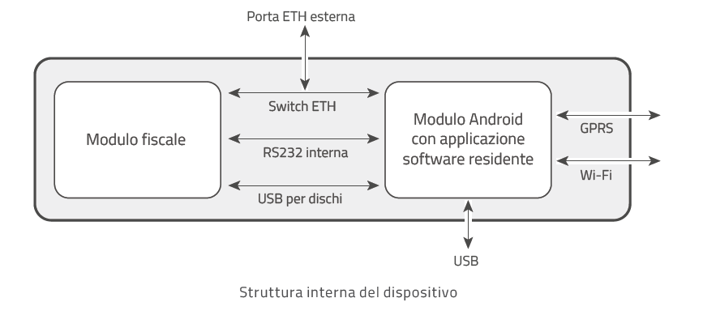
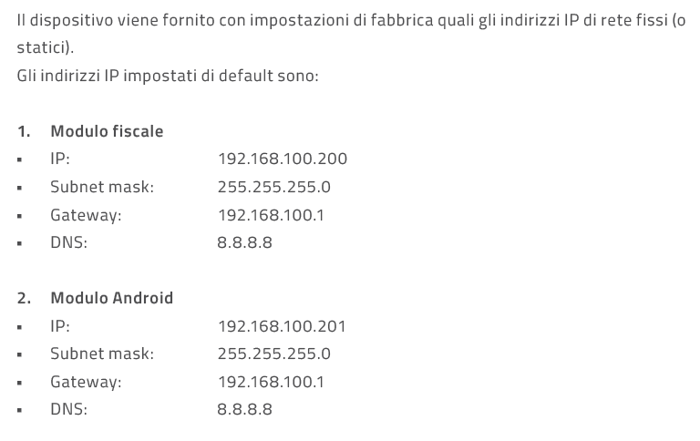

Per poter utilizzare i dispositivi della serie EDGE-N e EDGE-N+ a seguito della loro installazione fisica hardware, è strettamente necessario eseguire una procedura di configurazione software e di rete.
Questa fase _non costituisce un'opzione_, ma è il prerequisito tecnico e normativo indispensabile per abilitare il dispositivo alla trasmissione telematica dei file XML dei corrispettivi verso i server dell'Agenzia delle Entrate, operazione che avviene tipicamente in occasione della chiusura fiscale giornaliera. Senza tale configurazione, la macchina non è operativa per l'invio telematico.

## Collegamento Interno
Per eseguire una corretta messa in servizio, il tecnico installatore deve comprendere l'architettura interna del dispositivo.
La famiglia EDGE si basa su una topologia di sistema "Dual Engine", integrando due unità di elaborazione logiche all'interno del medesimo chassis fisico (design "All-in-One"): 
* Modulo fiscale: Dotato di processore dedicato a 100 MHz, rappresenta la "cassaforte fiscale" inaccessibile, preposta esclusivamente all'elaborazione dei dati di vendita, alla memorizzazione sul DGFE, alla firma elettronica e alla comunicazione sicura con l'Agenzia delle Entrate
* Modulo Android con applicazione software residente: dotato di processore Quad-Core 2.0GHz, è l'unità dedicata all'esecuzione del sistema operativo Android e dell'applicativo software gestionale residente (come le app di cassa o Keep UP Smart).
I due moduli condividono interfacce di espansione esterne (Porte USB per dischi, Wi-Fi, modem GPRS e porta Ethernet fisica), instradate internamente tramite uno Switch Ethernet dedicato.

## La Connessione di Comunicazione: Porta Seriale RS232 Interna
Il punto nevralgico della stabilità operativa di Edge N e N+ risiede nel metodo di comunicazione interna tra i due moduli.
Sullo schema a blocchi, la connessione interna primaria tra il Modulo Android e il Modulo Fiscale avviene tramite una Porta Seriale RS232 INTERNA.

Questa scelta progettuale ha implicazioni tecniche fondamentali:
Indipendenza dal TCP/IP Logico: Sebbene il modulo fiscale sia teoricamente raggiungibile dall'applicativo Android tramite il suo indirizzo IP, l'utilizzo del bus seriale interno è fortemente consigliato e implementato nativamente. Questo permette all'applicativo (es. l'App di sistema UtilityX RT o il gestionale Keep UP Custom) di interrogare il motore fiscale lavorando direttamente sul bus hardware (/dev/ttyHS1 logico a 57600 baud), risultando totalmente immune dalle variazioni degli indirizzi IP o dalle configurazioni di routing della rete LAN del cliente.
Stabilità di Comunicazione: Demandando al cavo seriale virtuale interno lo scambio dei comandi di cassa (scontrini, resi, annulli), non si incorre mai nel problema di "cassa non trovata" dal gestionale a seguito di uno spegnimento o di un rinnovo del lease DHCP del router.

## Gestione della Rete verso il Mondo Esterno
Se il bus Seriale RS232 Interna risolve la comunicazione intra-modulo (Software → RT), la connessione TCP/IP resta fondamentale per la comunicazione extra-modulo (RT → Agenzia delle Entrate).
Di fabbrica, l'apparato presenta una configurazione IP statica e non instradata su Internet:
IP Modulo Fiscale (Default): 192.168.100.200
IP Modulo Android (Default): 192.168.100.201 (Subnet Mask: 255.255.255.0 | Gateway: 192.168.100.1)

Azione Richiesta: Il tecnico dovrà utilizzare le impostazioni di sistema e l'app di gestione (UtilityX RT) per attivare l'assegnazione dinamica DHCP su entrambi i moduli. In caso di connessione tramite Wi-Fi o GPRS (SIM interna), diventerà obbligatorio attivare il Tethering Hardware (voce Impostazioni di Android - Rete e Internet - Hotspot Tehering - "Attivazione modulo RT wireless") lato Android, per permettere al Modulo Fiscale di sfruttare il canale radio del Modulo Android per trasmettere i corrispettivi telematici all'Agenzia delle Entrate.

### Documentazione Utile
[Guida di Configurazione](assets/resources/manualeassistenzaedgen_edgen2.PDF)

