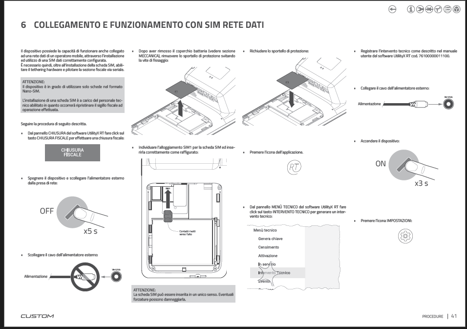
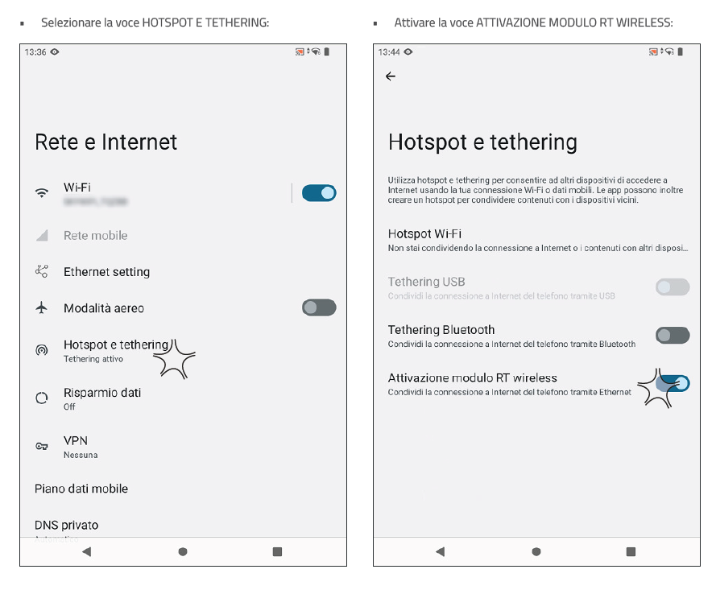

# Come connettere EDGE N/N+ tramite SIM DATI

Il dispositivo **Custom EDGE N** possiede la capacità di funzionare anche collegato ad una rete dati di un operatore mobile, attraverso l'installazione ed utilizzo di una SIM dati correttamente configurata.
E' necessario quindi, oltre all'installazione della scheda SIM, **abilitare il tethering hardware** e pilotare il modulo fiscale via seriale.

!!! **ATTENZIONE**
    Il dispositivo è in grado di utilizzare solo schede nel formato Nano-sim.
    L'installazione di una scheda SIM è a carico del personale tecnico abilitato in quanto occorrerà inviare l'evento di manutenzione ad operazione effettuata.

## Inserimetno SIM DATI

Dopo aver effettuato chiusura fiscale e spento EDGE, è possibile aprire tamper di accesso a SIM ed EJ ed individuare SIM1 all'interno del quale alloggiare apposita NANO-SIM.
[Vedere pagina 41 del presente manuale di assistenza](assets/resources/manualeassistenzaedgen_edgen2.PDF)

## Configurazione SIM DATI Android

* Accedere a IMPOSTAZIONI Android
* RETE E INTERNET
* Attivare **HOTSPOT E TETHERING**
* Attivare **ATTIVAZIONE MODULO RT WIRELESS**

