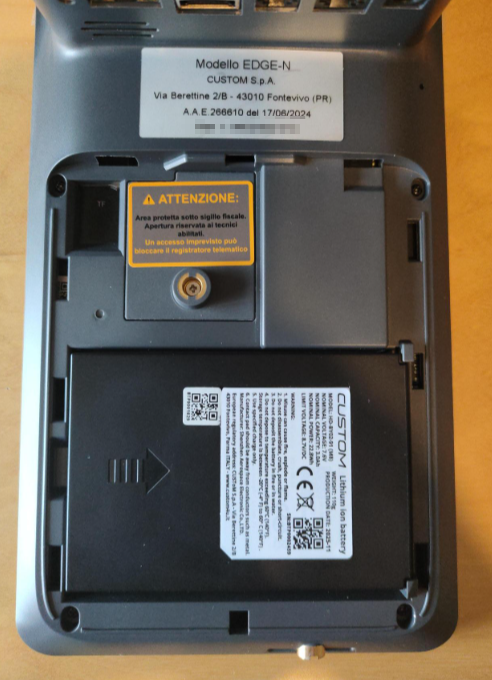
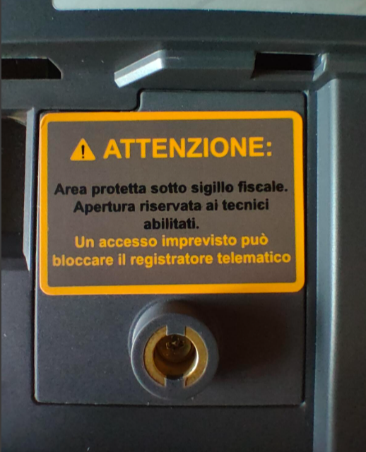
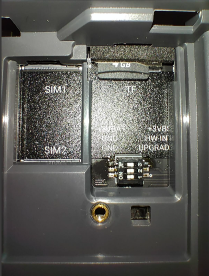

# TAMPER - SIGILLO FISCALE DIGITALE

Con la serie **EDGE** **CUSTOM S.p.a.** ha anticipato il mercato, introducendo il *SIGILLO FISCALE DIGITALE!*  

Si tratta di un sistema elettronico progettato per rilevare automaticamente qualsiasi apertura non autorizzata dell'involucro della cassa, funzionando persino a *macchina spenta*, rilevando automaticamente eventuali manomissioni del modulo fiscale, riconoscendo automaticamente l'apertura dell'involucro del dispositivo, e interrompendo immediatamente l’esecuzione delle funzioni a valenza fiscale.

*Ecco il suo funzionamento nel dettaglio:*
## Blocco Immediato
Se l'involucro viene forzato, l'RT interrompe all'istante tutte le funzioni a valenza fiscale e cancella i codici della lotteria istantanea ed e invia apposita segnalazione al sistema AE.

## Segnalazione Automatica:
Il dispositivo si imposta in stato di **"Fuori Servizio"** e trasmette immediatamente un alert di manomissione all'Agenzia delle Entrate, registrando data e ora nella memoria di riepilogo, tramite la compilazione della sezione 7 <Segnalazione>, indicata nell’allegato [“Tipi dati per i corrispettivi – versione 7.1"](assets/resources/AllegatoTipiDatiperiCorrispettiviver7.1.pdf) utilizzando il <Codice> 21, come da tabella 7.3 per comunicare l’apertura non autorizzata dell’involucro.

## Manutenzione Autorizzata:
L'apertura lecita è consentita solo ai tecnici abilitati, i quali devono "sbloccare" temporaneamente il sigillo inserendo le proprie credenziali (Codice Fiscale e Partita IVA) direttamente nell'apparecchio.

## Avviso Visivo:
Sulla cassa deve essere presente un'etichetta chiara in corrispondenza dell'apertura, che avverte l'utente del blocco automatico in caso di forzatura.
 