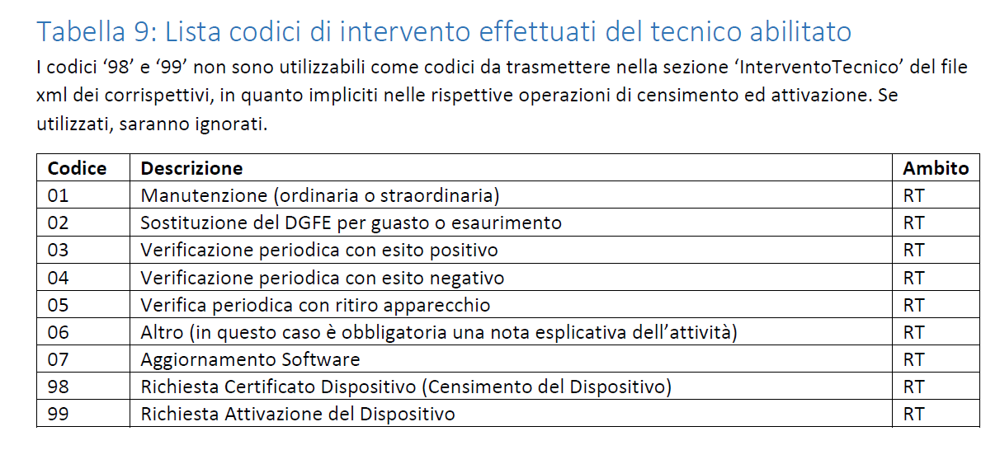

# VERIFICA PERIODICA

## Introduzione Normativa alla Verifica Periodica
Secondo le Specifiche Tecniche RT V11.1 dell'Agenzia delle Entrate, la "Verificazione Periodica" è un adempimento normativo obbligatorio che deve essere eseguito con cadenza **biennale** per accertare il regolare funzionamento del Registratore Telematico.
Questa operazione può essere effettuata esclusivamente da un Tecnico Abilitato facente parte di un laboratorio autorizzato.

## Azioni previste in VP
Le verificazioni periodiche effettuate dai tecnici dei laboratori abilitati prevedono almeno le seguenti azioni:
- controllo dell’integrità del sigillo fiscale;
- differenziare operazione tra sigillo integro e rimosso (autocertificazione esercente);
- prove minime come da [descrizione prove minime in VP](assets/resources/Descrizioneproveminime_v1.pdf)
- controllo, mediante prova a campione, del regolare funzionamento del modulo fiscale (ad esempio, la simulazione di alcune operazioni commerciali e conseguente verifica – mediante lettura e stampa, anche virtuale – della corretta registrazione dei dati nella memoria permanete di dettaglio e in quella di riepilogo, nonché la chiusura di cassa, l’invio del file XML e il riscontro dell’esito da parte del Sistema AE).

!!! warning 
    Al termine delle operazioni di verifica periodica, il tecnico registra - mediante apposita funzionalità del RT - l’esito della verificazione eseguita rispettando la codifica prevista nella tabella 9 dell’allegato “Code List”. Tutte le informazioni, quindi anche CF del tecnico e la PIVA del laboratorio, verranno memorizzate nella memoria permanente di riepilogo e inviate, insieme ai dati dei corrispettivi, alla prima trasmissione successiva alla verificazione periodica.
    Il dispositivo deve essere in grado di proporre degli avvisi all’utente a partire dai 30 giorni precedenti la scadenza.
    In caso di superamento della data della Verificazione Periodica il dispositivo stampa in chiusura giornaliera l’indicazione di “Registratore Telematico privo di VP”.

## Lista codici di intervento tecnico

Di seguito è riportata la tabella riepilogativa (Tabella 9) contenente i codici di intervento effettuati dal tecnico abilitato da utilizzare durante le operazioni sui Registratori Telematici.

!!! warning "Attenzione ai codici 98 e 99"
    I codici **'98'** e **'99'** non sono utilizzabili come codici da trasmettere nella sezione `InterventoTecnico` del file xml dei corrispettivi, in quanto impliciti nelle rispettive operazioni di censimento ed attivazione. Se utilizzati, saranno ignorati.

| Codice | Descrizione | Ambito |
| :---: | :--- | :---: |
| **01** | Manutenzione (ordinaria o straordinaria) | RT |
| **02** | Sostituzione del DGFE per guasto o esaurimento | RT |
| **03** | Verificazione periodica con esito positivo | RT |
| **04** | Verificazione periodica con esito negativo | RT |
| **05** | Verifica periodica con ritiro apparecchio | RT |
| **06** | Altro (in questo caso è obbligatoria una nota esplicativa dell'attività) | RT |
| **07** | Aggiornamento Software | RT |
| **98** | Richiesta Certificato Dispositivo (Censimento del Dispositivo) | RT |
| **99** | Richiesta Attivazione del Dispositivo | RT |

